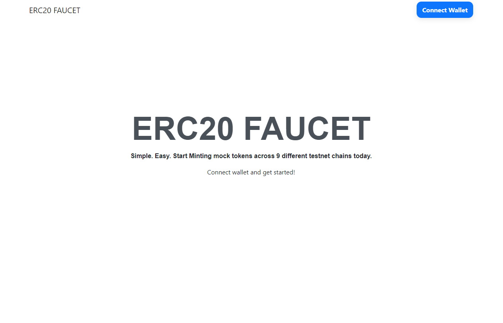

# ERC20Faucet-RainbowKit

## **WARNING**
### The following code has **NOT BEEN AUDITED** and is **UNSUITABLE and SHOULD NOT BE USED** for production. The smart contract allows **ANY** externally owned account or contract to **mint unlimited number of tokens**. Please note that I will not be liable for any form of losses incurred from interaction with code in this repository.  
### **Reminder**: 
1. **DO NOT EXPOSE** your **private keys/ seed phrase** to anyone. 
2. It is recommended to use a wallet which **DOES NOT** contains **ANY REAL FUNDS/ MONEY** if you were to clone/ fork this repository for testing purposes.

___
  
  This repository contains code for a simple ERC20 token faucet that is developed with the help of [RainbowKit](https://www.rainbowkit.com/) and [WAGMI](https://wagmi.sh/). The token faucet is deployed/ deployable on multiple different EVM-compatible chains **(deployed on testnet only)**. 
  They can also be found on `client/src/configs/chains.ts` or `client/src/chains/` 

### Deployed Chains and contract addresses

| Chains Supported      | Contract Address | 
| ----------- | ----------- |
| `Goerli (ETH)`      | `0x53cE04651834cD8db7bd618C0ce96B72aEA1bDf9`       |
| `Polygon Mumbai`   | `0x53cE04651834cD8db7bd618C0ce96B72aEA1bDf9`        |
| `Arbitrum Rinkeby`   | `0x53cE04651834cD8db7bd618C0ce96B72aEA1bDf9`        |
| `Moonbase Testnet`   | `0x53cE04651834cD8db7bd618C0ce96B72aEA1bDf9`        |
| `Avalanche Fuji`   | `0x53cE04651834cD8db7bd618C0ce96B72aEA1bDf9`        |
| `Fantom Testnet`   | `0x53cE04651834cD8db7bd618C0ce96B72aEA1bDf9`        |
| `Cronos Testnet`   | `0x53cE04651834cD8db7bd618C0ce96B72aEA1bDf9`        |
| `Milkomeda Tesnet`   | `0x53cE04651834cD8db7bd618C0ce96B72aEA1bDf9`        |
| `BNBChain Testnet`   | `0x53cE04651834cD8db7bd618C0ce96B72aEA1bDf9`        |
--- 

**Cloning the repository**

````
git clone https://github.com/railBitsAndHex/ERC20Faucet-RainbowKit.git
````

**Installing client side packages**  

Open an instance of the terminal (for my case I use VSCode terminal)
````
cd client
yarn add
````
**Installing contract related packages (E.g. Hardhat)**  

Open an instance of the terminal (for my case I use VSCode terminal)
````
cd contracts
yarn add
````

**Client Side Start Up**
````
cd client
yarn start
````

**Contract deployment**  
Network names can be found in `networks` field of `config` object in `contracts/hardhat.config.ts`
````
cd contracts
yarn hardhat deploy --network <enter-network-name-here>
````

**Contracts testing**
Network names can be found in `networks` field of `config` object in `contracts/hardhat.config.ts`
````
cd contracts
yarn hardhat test --network <enter-network-name-here>
````
